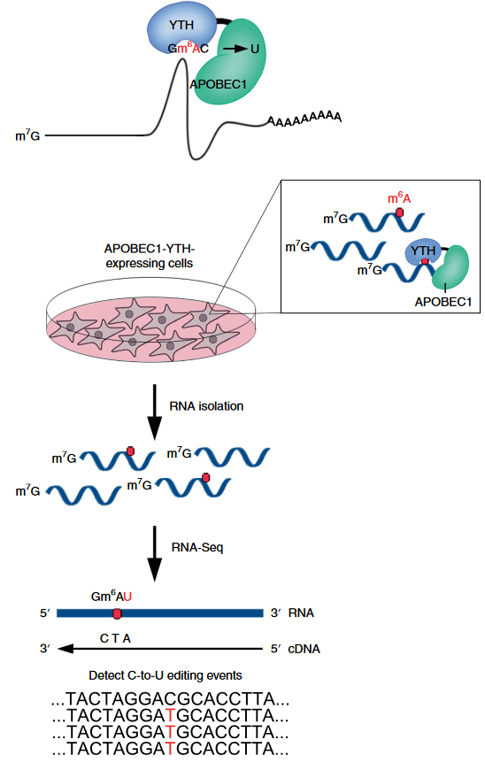

# m6a
m6a

# Long read sequencing for m6A

## DART-seq, _Meyer, Nature Methods, 2019_

> DART-seq (deamination adjacent to RNA modification targets), in which we transiently transfected APOBEC1-YTH into cells and then subjected total RNA to high-throughput sequencing followed by C-to-U mutation detection

## Base calling parameters
### ONT parameters
~accuracy mode~

- Fast (FAST)
- High accuracy (HAC)
- **Super accuracy (SUP)**

### Seq parameters

**dna_r10.4.1_e8.2_260bps_sup.cfg**

- kit: SQK-LSK114
- flow cell: FLO-MIN114 (r10.4.1)
- sequencer: MinION Mk1c
- speed: accurate (260bps)

